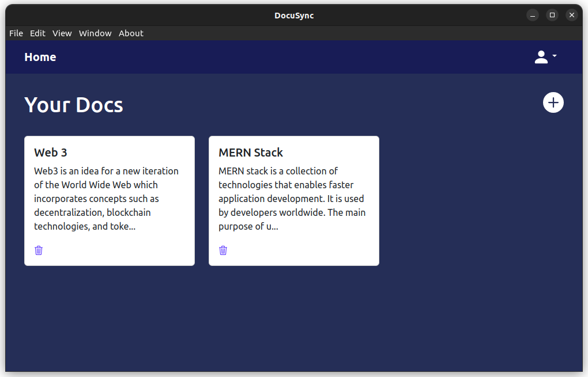
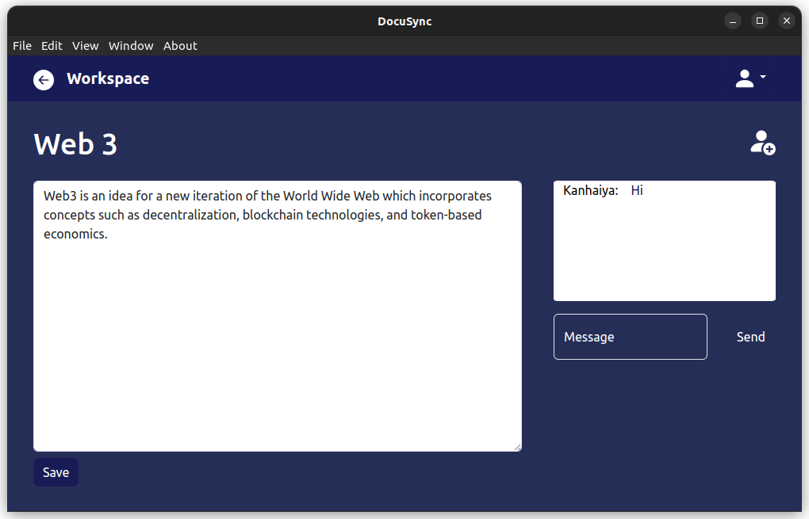

# DocSync

A collaborative text editor desktop application designed for seamless teamwork.

Some of the key features

- User authentication
- Real-time collaboration
- Real-time Chatting support
- Only authorized users can edit or access specific documents
- MongoDB integration for storing the documents
- Supports Windows, MacOS, and Linux as well

**Home Page**


**Workspace Page**


**Demo**


# Installation

## Download Pre-built Packages

Download the latest release for your platform from the [Releases page](https://github.com/kanhaiya04/DocuSync/releases).

### Ubuntu/Debian

```bash
# Download the .deb file from releases
sudo dpkg -i docsync_0.0.1_amd64.deb

# Fix any dependency issues
sudo apt-get install -f

# Run the app
docsync
```

### Fedora/RHEL/CentOS

```bash
# Download the .rpm file from releases
sudo dnf install ./docsync-0.0.1-1.x86_64.rpm

# Or using rpm
sudo rpm -i docsync-0.0.1-1.x86_64.rpm

# Run the app
docsync
```

### Windows

```bash
# Download the .exe installer from releases
# Run DocuSync-0.0.1 Setup.exe
# Follow the installation wizard
```

## Server Configuration

The app connects to the backend server at: **https://docusyncbackend.onrender.com**

# Build from Source Code

Clone the repo

```bash
git clone https://github.com/kanhaiya04/DocuSync.git
cd DocuSync/
```

**Use the npm package manager to install dependencies**

Electron dependencies:

```bash
cd client/
npm install
```

**Note: Update the host url in React components to - https://docusyncbackend.onrender.com**

Install React dependencies:

```bash
cd client/app
npm install
```

Build app from react components

```bash
cd client/app
npm run build
```

Build docSync from source code for your platform

```bash
cd client/
npm run make
```

**Once the build process is successfully completed, you will find the installation package in the "out" folder.**

# Run from source code for development

Clone the repo

```bash
git clone https://github.com/kanhaiya04/DocuSync.git
cd DocuSync/
```

Create and configure .env file

```bash
touch .env
cp .env.sample .env
```

update the values in the .env file

**Use the npm package manager to install dependencies**

Install express dependencies:

```bash
cd server/
npm install
```

Run the express server

```bash
cd server/
node index
```

Install react dependencies:

```bash
cd client/app
npm install
```

Build the app from components

```bash
cd client/app
npm run build
```

Install electron dependencies:

```bash
cd client/
npm install
```

Run the electron app locally

```bash
cd client/
npm start
```

**Now you are good to make contributions to the code base.**
