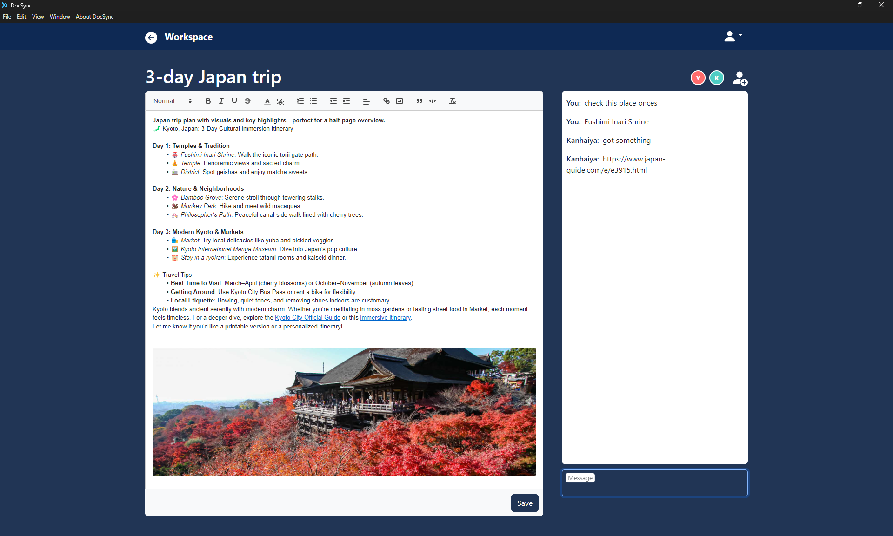

# DocuSync

A collaborative text editor desktop application designed for seamless teamwork.

Some of the key features

- User authentication
- Real-time collaboration
- Only authorized users can edit or access specific documents
- MongoDB integration for storing the documents
- Supports Windows, MacOS, and Linux as well

**Home Page**


**Workspace Page**


# Build from Source Code

Clone the repo

```bash
git clone https://github.com/kanhaiya04/DocuSync.git
cd DocuSync/
```

Use the package manager to install dependencies

Electron dependencies:
```bash
cd client/
npm install
```
Note: Update the host url in React components to - 

Install React dependencies:
```bash
cd client/app
npm install
```

Build app from react components
```bash
cd client/app
npm run build
```

Build DocuSync from source code for your platform
```bash
cd client/
npm run make
```

Once the build process is successfully completed, you will find the installation package in the "out" folder.


# Run from source code for development 


**Clone the repo**

```bash
git clone https://github.com/kanhaiya04/DocuSync.git
cd DocuSync/
```

**Create and configure .env file**

```bash
touch .env
cp .env.sample .env
```
update the values in the .env file


**Use the npm package manager to install dependencies**

INstall express dependencies:
```bash
cd server/
npm install
```

**Run the express server**


Install react dependencies:
```bash
cd client/app
npm install
```

**Build the app from components**

```bash
cd client/app
npm run build
```

Install electron dependencies:
```bash
cd client/
npm install
```

**Run the electron app locally**
```bash
cd client/
npm run
```


